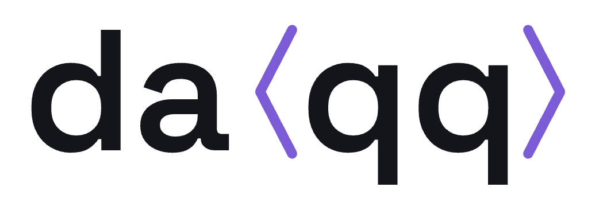

<p align="center">
  <picture>
    <source media="(prefers-color-scheme: dark)" srcset="docs/static/logo/daqq-wordmark-reversed.png">
    
  </picture>
</p>

<p align="center">
  <a href="https://daqq.pages.dev/docs/"></a>
  <a href="https://daqq.pages.dev/gui/"></a>
  <a href="deploy/JOIN.md"></a>
</p>

# daqq

**daqq** is a project exploring quantum applications and blockchain integration. It contains a Random Quantum Circuit generator and a Cosmos SDK-based blockchain.

Full documentation is published at **[daqq.pages.dev](https://daqq.pages.dev/docs/)** (source under [`docs/`](docs/)), and the live network visualizer runs at **[daqq.pages.dev/gui](https://daqq.pages.dev/gui/)**. See [docs/README.md](docs/README.md) for build and deploy instructions.

**Want to join the live network?** You can run a full node that syncs
`quantum-chain` — no stake, no reward, no ports to open on your side. Access is
**by application**: daqq is a small curated network, so the sentry only admits
approved source IPs. Request access and connect per [`deploy/JOIN.md`](deploy/JOIN.md).

To run a node 24/7 (Oracle Cloud Always Free + Cloudflare Tunnel) and roll out protocol-version upgrades with no downtime via Cosmovisor, see the deployment runbook in [`deploy/README.md`](deploy/README.md).

## Protocol

In daqq, the *protocol* is the set of application-level **data structures that participants
share over the network** — the quantum-circuit problem and the data exchanged around it — not
the underlying transport. Every shared structure is defined as a versioned Protocol Buffers
schema under [`quantum-chain/proto/quantumchain/`](quantum-chain/proto/quantumchain/). The
current protocol version is **v1**.

| Shared structure | Proto package | Version | What it carries |
|------------------|---------------|---------|-----------------|
| Problem registry | `quantumchain.problems.v1` | v1 | `Problem{id, name, module_name, kind, enabled, added_at_round, description}` — the append-only registry of problems the network can solve |
| Random-circuit problem | `quantumchain.random_circuit.v1` | v1 | `Distribution` (computational-basis state → probability) and `ResultData` / `MsgSubmitResult` (a participant's submitted solution for a round) |
| Shared random (beacon) | `quantumchain.beacon.v1` | v1 | the commit/reveal random seed finalized every 50 blocks |

Bumping any of these shapes means cutting a new proto version (`v2`, …); update this table when you do.

> Underlying infrastructure (transport, not the daqq protocol): the chain is a Cosmos SDK
> v0.53.4 application running on CometBFT v0.38.19 for BFT consensus and P2P gossip. These
> versions are pinned in [`quantum-chain/go.mod`](quantum-chain/go.mod).

## Quick Start

All Quick Start steps below are also automated in [`Taskfile.quickstart.yml`](Taskfile.quickstart.yml). If you have [Task](https://taskfile.dev) installed, you can drive the whole flow with short commands instead of running the raw `quantumchaind` invocations by hand. Point Task at the file with `-t`:

```bash
task -t Taskfile.quickstart.yml --list   # show every available task

# Single-node chain
task -t Taskfile.quickstart.yml install      # build & install the quantumchaind binary
task -t Taskfile.quickstart.yml quickstart   # init + start a single-node chain

# 3-node distributed ledger (alice / bob / carol)
task -t Taskfile.quickstart.yml localnet:init           # one-time setup
task -t Taskfile.quickstart.yml localnet:start:alice    # run in terminal 1
task -t Taskfile.quickstart.yml localnet:start:bob      # run in terminal 2
task -t Taskfile.quickstart.yml localnet:start:carol    # run in terminal 3
task -t Taskfile.quickstart.yml localnet:status         # verify height/hash/peers

# Cleanup (asks for confirmation)
task -t Taskfile.quickstart.yml quickstart:clean
task -t Taskfile.quickstart.yml localnet:clean

# Circuit Generator
task -t Taskfile.quickstart.yml circuit
```

The sections below describe the same steps manually so you can see exactly what each task does.

### Start Quantum Chain

To bring up a single-node chain locally, operate `quantumchaind` directly instead of using `ignite`.

```bash
cd quantum-chain
make install   # install the quantumchaind binary into $GOPATH/bin

export CHAIN_ID=quantum-chain
export HOME_DIR=~/.quantumchain

quantumchaind init mynode --chain-id $CHAIN_ID --home $HOME_DIR
quantumchaind keys add alice --home $HOME_DIR --keyring-backend test

ALICE_ADDR=$(quantumchaind keys show alice -a --home $HOME_DIR --keyring-backend test)
quantumchaind genesis add-genesis-account $ALICE_ADDR 200000000stake --home $HOME_DIR
quantumchaind genesis gentx alice 100000000stake --chain-id $CHAIN_ID \
  --home $HOME_DIR --keyring-backend test
quantumchaind genesis collect-gentxs --home $HOME_DIR

quantumchaind start --home $HOME_DIR
```

For building a distributed ledger across multiple nodes, see [Simulate a Multi-Participant Distributed Ledger on a Single PC](#simulate-a-multi-participant-distributed-ledger-on-a-single-pc) below. The [Quantum Chain README](quantum-chain/readme.md) also has additional details.

### Simulate a Multi-Participant Distributed Ledger on a Single PC

This procedure launches multiple nodes (participants) simultaneously on a single local PC and connects them via P2P to form a simulated distributed-ledger network. Each node runs from its own home directory on separate ports, and agrees on a single chain by sharing the same genesis and chain-id.

Here we use three participants — `alice`, `bob`, and `carol` — as an example.

#### 0. Prerequisites

- The `quantumchaind` binary must be installed (if not, run `cd quantum-chain && make install`).
- `jq` must be available (used for editing the genesis file).
- The default Cosmos SDK ports (26656, 26657, 1317, 9090, etc.) must be free.

The working directory below is arbitrary (e.g. `~/daqq-localnet`).

```bash
export CHAIN_ID=quantum-chain
export NET_ROOT=~/daqq-localnet
mkdir -p "$NET_ROOT"
export HOME_A=$NET_ROOT/alice
export HOME_B=$NET_ROOT/bob
export HOME_C=$NET_ROOT/carol
```

#### 1. Initialize each participant's node

Create an independent home directory for each participant and initialize it with a moniker (node name).

```bash
quantumchaind init alice --chain-id $CHAIN_ID --home $HOME_A
quantumchaind init bob   --chain-id $CHAIN_ID --home $HOME_B
quantumchaind init carol --chain-id $CHAIN_ID --home $HOME_C
```

#### 2. Create keys and register genesis accounts

Use Alice's node as the "genesis creator" and register accounts for all participants. Because daqq aims to let participants build a distributed ledger together without rewards, no user-balance tokens are distributed. `stake` is allocated only in the minimum amount required for a PoS validator to participate in block production.

```bash
# Create each participant's key in their own home (keyring-backend=test for testing)
quantumchaind keys add alice --home $HOME_A --keyring-backend test
quantumchaind keys add bob   --home $HOME_B --keyring-backend test
quantumchaind keys add carol --home $HOME_C --keyring-backend test

# Add the three addresses to Alice's genesis (stake only, for validator participation)
ALICE_ADDR=$(quantumchaind keys show alice -a --home $HOME_A --keyring-backend test)
BOB_ADDR=$(quantumchaind keys show bob   -a --home $HOME_B --keyring-backend test)
CAROL_ADDR=$(quantumchaind keys show carol -a --home $HOME_C --keyring-backend test)

quantumchaind genesis add-genesis-account $ALICE_ADDR 200000000stake --home $HOME_A
quantumchaind genesis add-genesis-account $BOB_ADDR   200000000stake --home $HOME_A
quantumchaind genesis add-genesis-account $CAROL_ADDR 200000000stake --home $HOME_A
```

#### 3. Create and aggregate gentx (validator participation requests)

Each participant creates a gentx on their own node, then aggregates them into Alice's genesis.

```bash
# Bob and Carol copy the genesis accounts into their own home before creating gentx
cp $HOME_A/config/genesis.json $HOME_B/config/genesis.json
cp $HOME_A/config/genesis.json $HOME_C/config/genesis.json

quantumchaind genesis gentx alice 100000000stake --chain-id $CHAIN_ID \
  --home $HOME_A --keyring-backend test
quantumchaind genesis gentx bob   100000000stake --chain-id $CHAIN_ID \
  --home $HOME_B --keyring-backend test
quantumchaind genesis gentx carol 100000000stake --chain-id $CHAIN_ID \
  --home $HOME_C --keyring-backend test

# Gather Bob's and Carol's gentx into Alice's gentx directory
cp $HOME_B/config/gentx/*.json $HOME_A/config/gentx/
cp $HOME_C/config/gentx/*.json $HOME_A/config/gentx/

# Aggregate them to produce the final genesis
quantumchaind genesis collect-gentxs --home $HOME_A
quantumchaind genesis validate --home $HOME_A
```

Distribute the final genesis to Bob and Carol.

```bash
cp $HOME_A/config/genesis.json $HOME_B/config/genesis.json
cp $HOME_A/config/genesis.json $HOME_C/config/genesis.json
```

#### 4. Assign ports and configure peer connections

To run multiple nodes on one PC, shift the ports and let them discover each other via `persistent_peers`.

| Node  | P2P (26656) | RPC (26657) | API (1317) | gRPC (9090) |
|-------|-------------|-------------|------------|-------------|
| alice | 26656       | 26657       | 1317       | 9090        |
| bob   | 26666       | 26667       | 1318       | 9091        |
| carol | 26676       | 26677       | 1319       | 9092        |

```bash
# Alice can keep the default ports (no need to edit laddr in config.toml)
# Change ports for Bob and Carol
sed -i '' 's/:26656/:26666/g; s/:26657/:26667/g' $HOME_B/config/config.toml
sed -i '' 's/:1317/:1318/g;  s/:9090/:9091/g'   $HOME_B/config/app.toml

sed -i '' 's/:26656/:26676/g; s/:26657/:26677/g' $HOME_C/config/config.toml
sed -i '' 's/:1317/:1319/g;  s/:9090/:9092/g'   $HOME_C/config/app.toml

# Obtain each node's Node ID
ID_A=$(quantumchaind comet show-node-id --home $HOME_A)
ID_B=$(quantumchaind comet show-node-id --home $HOME_B)
ID_C=$(quantumchaind comet show-node-id --home $HOME_C)

# Set persistent_peers so each node knows the other two
PEERS_A="$ID_B@127.0.0.1:26666,$ID_C@127.0.0.1:26676"
PEERS_B="$ID_A@127.0.0.1:26656,$ID_C@127.0.0.1:26676"
PEERS_C="$ID_A@127.0.0.1:26656,$ID_B@127.0.0.1:26666"

sed -i '' "s/^persistent_peers = .*/persistent_peers = \"$PEERS_A\"/" $HOME_A/config/config.toml
sed -i '' "s/^persistent_peers = .*/persistent_peers = \"$PEERS_B\"/" $HOME_B/config/config.toml
sed -i '' "s/^persistent_peers = .*/persistent_peers = \"$PEERS_C\"/" $HOME_C/config/config.toml

# Because the nodes connect to each other locally, enable allow_duplicate_ip
sed -i '' 's/^allow_duplicate_ip = .*/allow_duplicate_ip = true/' $HOME_A/config/config.toml
sed -i '' 's/^allow_duplicate_ip = .*/allow_duplicate_ip = true/' $HOME_B/config/config.toml
sed -i '' 's/^allow_duplicate_ip = .*/allow_duplicate_ip = true/' $HOME_C/config/config.toml
```

> Use `sed -i ''` on macOS and `sed -i` on Linux.

#### 5. Start the three nodes simultaneously

Start the three nodes in separate terminals.

```bash
# Terminal 1
quantumchaind start --home $HOME_A
```

```bash
# Terminal 2
quantumchaind start --home $HOME_B
```

```bash
# Terminal 3
quantumchaind start --home $HOME_C
```

Within a few seconds the P2P handshake runs, and once all nodes advance at the same block height the distributed ledger is in place.

#### 6. Verify the distributed ledger

From another terminal, query the latest block height of each node to confirm they are in sync.

```bash
curl -s localhost:26657/status | jq '.result.sync_info.latest_block_height'
curl -s localhost:26667/status | jq '.result.sync_info.latest_block_height'
curl -s localhost:26677/status | jq '.result.sync_info.latest_block_height'
```

If all three nodes advance at the same block height with the same block hash, a shared distributed ledger has been formed. You can also check the list of peers each node recognizes.

```bash
# Check that block height and block hash match
curl -s localhost:26657/block | jq '.result.block.header | {height, hash: .last_block_id.hash}'
curl -s localhost:26667/block | jq '.result.block.header | {height, hash: .last_block_id.hash}'
curl -s localhost:26677/block | jq '.result.block.header | {height, hash: .last_block_id.hash}'

# Check that they recognize each other as peers
curl -s localhost:26657/net_info | jq '.result.n_peers'
```

#### 7. Stop the network and clean up

Press `Ctrl-C` in each terminal. To completely reset the state:

```bash
rm -rf $NET_ROOT
```

This completes the full flow of launching a multi-participant simulated network on a single PC and building and verifying a shared distributed ledger.

### Run Circuit Generator

To run the random quantum circuit generator:

```bash
go run main.go
```

This will:

1. Generate a random quantum circuit configuration.
2. Simulate the circuit state.
3. Output the state probabilities to the console.
4. Generate a `line.html` file with a visualization of the probability density.

## Components

### Quantum Chain

`quantum-chain` is a blockchain built using Cosmos SDK and CometBFT (the successor to Tendermint Core). The data structures participants share on it are described in [Protocol](#protocol). The scaffold was originally generated with [Ignite CLI](https://ignite.com/cli), but building, running, and proto generation are all done directly with `make`, `quantumchaind`, and `buf`, so Ignite is not required for day-to-day use.

### Random Quantum Circuit Generator

The root directory contains a Go program that generates a random quantum circuit and simulates it.
