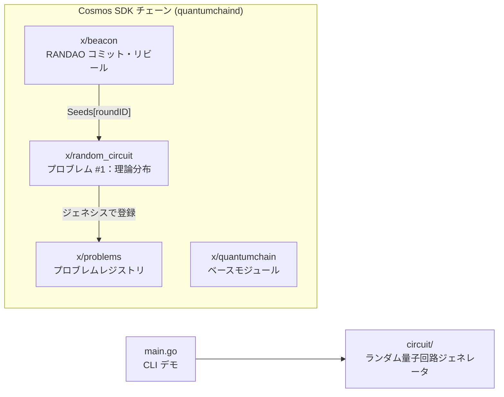
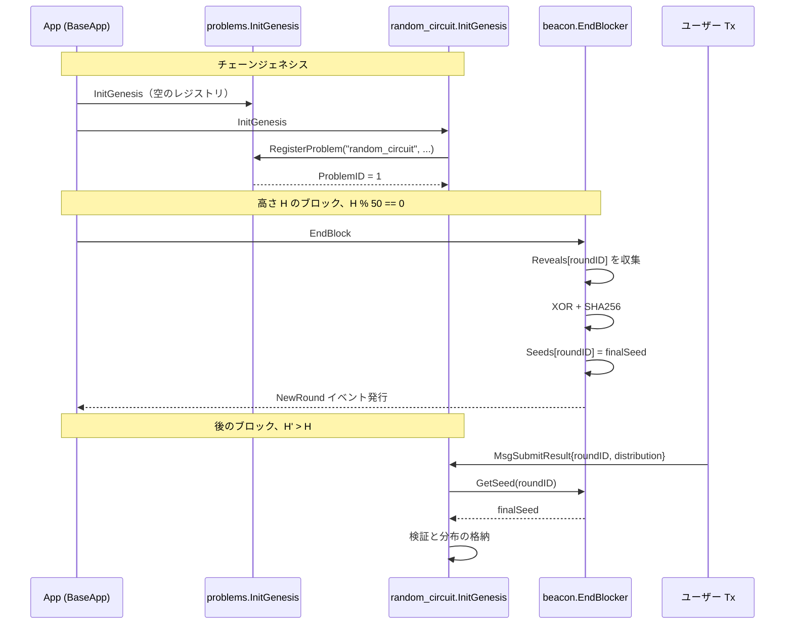

daqq は Cosmos SDK 上に構築されています。マルチプロブレムレジストリへの移行（[プロブレムシステム]() を参照）後、`quantum-chain/x/` 配下のチェーン独自モジュールは次の通りです。



## モジュール

### x/beacon
**コミット → リビール → XOR 集約**のランダムネスビーコンを実装しています。50 ブロックごとに新しいラウンドが閉じ、すべてのノードが合意する 256 ビットのシードが確定されます。完全なライフサイクルは [ビーコンプロトコル](modules/beacon) を参照してください。

### x/problems
プロブレムの**オンチェーンレジストリ**。`Problem{id, name, module_name, kind, enabled, added_at_round, description}` エントリと単調増加する `NextProblemID` を保持します。プロブレムモジュールはジェネシスまたはアップグレードでここに自己登録します。エントリは決して削除されません。無効化は gov 提案で行うフラグの切り替えです。[problems モジュール](modules/problems) を参照してください。

### x/random_circuit（旧 x/qcledger）
**プロブレム #1**。各ビーコンラウンドのシードから生成されたランダム回路について、参加者が計算した**理論的出力確率分布**を格納します。ジェネシス時に `x/problems` に自己登録します。`roundID = R` の提出は、`beacon.Seeds[R]` がすでに存在しない限り拒否されます — 台帳はビーコンに因果的に依存します。[random_circuit モジュール](modules/random_circuit) を参照してください。

### x/quantumchain
チェーンのベースモジュール — パラメータ、ジェネシス状態、チェーンレベルのアイデンティティを登録します。

## 実行順序

Cosmos SDK は各ブロックで `EndBlocker` フックを固定された順序で実行します。`quantum-chain/app/app_config.go` より：

```
EndBlockers: [
  ...
  quantumchain,
  beacon,         # 高さ % 50 == 0 でラウンドシードを確定
  random_circuit,
  problems,
  ...
]
```

`InitGenesis` の順序も重要です：`problems` は `random_circuit` より**前**に走るので、後者が自身のジェネシス初期化中に自己登録できます。

```
InitGenesis: [
  ...
  quantumchain,
  beacon,
  problems,       # レジストリが先に存在する必要がある
  random_circuit, # プロブレム #1 として自己登録
]
```

## モジュール間の依存



## リポジトリ構成

```
daqq/
├─ main.go                  # CLI デモ（現在は時刻ベースのシードを使う）
├─ circuit/                 # ランダム量子回路ジェネレータ
├─ quantum-chain/           # Cosmos SDK チェーン
│  ├─ app/                  # アプリ配線、モジュール順序
│  ├─ cmd/quantumchaind/    # ノードバイナリのエントリポイント
│  ├─ x/beacon/             # ランダムネスビーコンモジュール
│  ├─ x/problems/           # プロブレムレジストリモジュール
│  ├─ x/random_circuit/     # プロブレム #1（理論分布）
│  └─ x/quantumchain/       # ベースモジュール
├─ docs/                    # このドキュメントサイト（Hugo + Hextra）
└─ Taskfile.quickstart.yml  # ローカルネット／クイックスタート自動化
```
