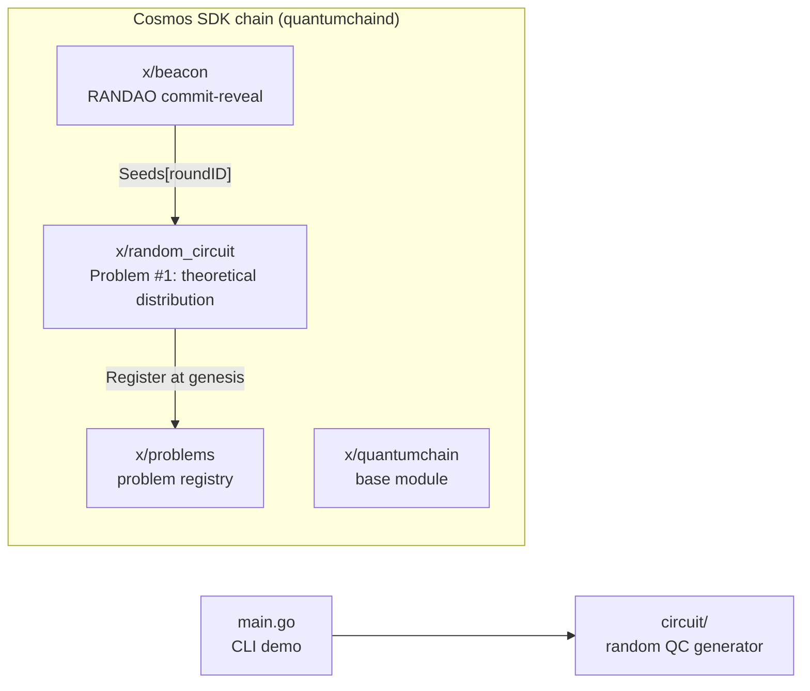
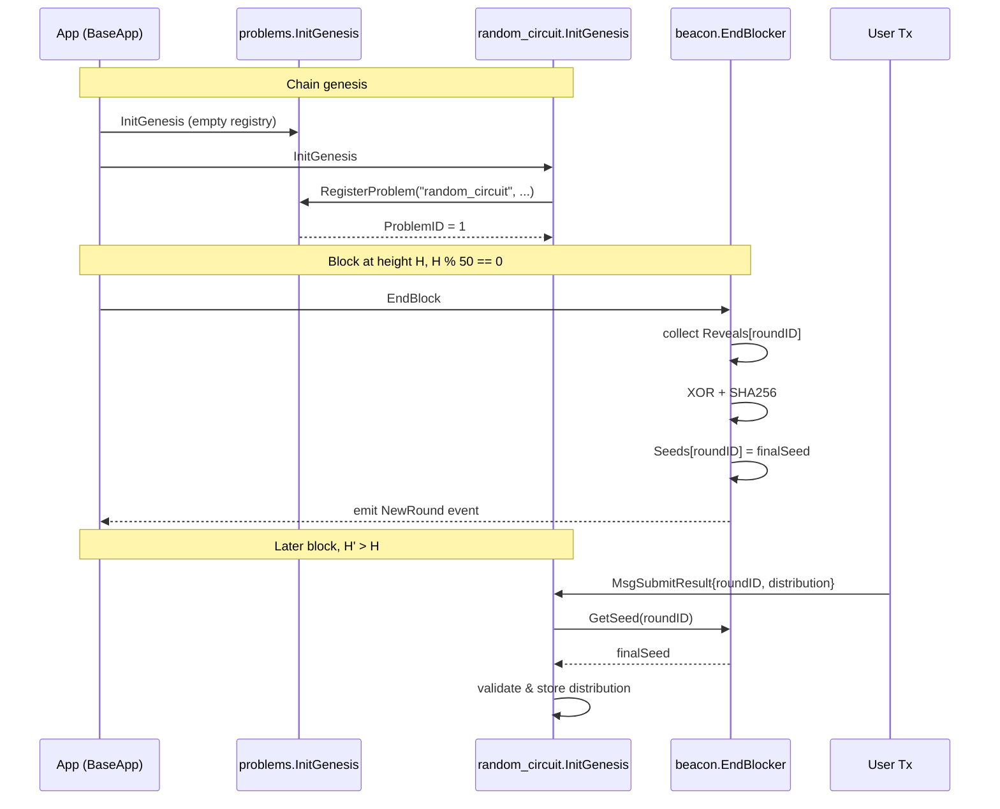

daqq is built on the Cosmos SDK. After the move to a multi-problem registry (see [Problem System]()), the chain's custom modules under `quantum-chain/x/` are:



## Modules

### x/beacon
Implements a **commit → reveal → XOR-aggregate** randomness beacon. Every 50 blocks a new round closes, and a 256-bit seed is finalised that all nodes agree on. See [Beacon Protocol](modules/beacon) for the full lifecycle.

### x/problems
On-chain **registry** of problems. Holds `Problem{id, name, module_name, kind, enabled, added_at_round, description}` entries and a monotonically increasing `NextProblemID`. Problem modules register themselves here at genesis or via upgrade. Entries are never deleted; disabling is a gov-gated flag flip. See [problems module](modules/problems).

### x/random_circuit (formerly x/qcledger)
**Problem #1.** Stores the **theoretical output probability distribution** participants compute for the random circuit generated from each beacon round's seed. Self-registers in `x/problems` at genesis. A submission for `roundID = R` is rejected unless `beacon.Seeds[R]` already exists — the ledger is causally dependent on the beacon. See [random_circuit module](modules/random_circuit).

### x/quantumchain
The chain's base module — registers parameters, genesis state, and the chain-level identity.

## Execution order

The Cosmos SDK runs `EndBlocker` hooks in a fixed order each block. From `quantum-chain/app/app_config.go`:

```
EndBlockers: [
  ...
  quantumchain,
  beacon,         # finalises the round seed at height % 50 == 0
  random_circuit,
  problems,
  ...
]
```

`InitGenesis` order is important: `problems` runs **before** `random_circuit`, so the latter can self-register during its own genesis init:

```
InitGenesis: [
  ...
  quantumchain,
  beacon,
  problems,       # registry must exist first
  random_circuit, # registers itself as Problem #1
]
```

## Inter-module dependency



## Repository layout

```
daqq/
├─ main.go                  # CLI demo (currently uses time-based seed)
├─ circuit/                 # random quantum circuit generator
├─ quantum-chain/           # the Cosmos SDK chain
│  ├─ app/                  # app wiring, module order
│  ├─ cmd/quantumchaind/    # node binary entry point
│  ├─ x/beacon/             # randomness beacon module
│  ├─ x/problems/           # problem registry module
│  ├─ x/random_circuit/     # Problem #1 (theoretical distribution)
│  └─ x/quantumchain/       # base module
├─ docs/                    # this documentation site (Hugo + Hextra)
└─ Taskfile.quickstart.yml  # localnet / quickstart automation
```
