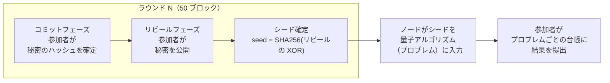

このページは、[概要]()（「daqq とは何か」）と [アーキテクチャ]()（「コードがどう構成されているか」）の橋渡しです。ブロックチェーンやコミット・リビール方式のランダム性が初めての方は、まずこれを読んでください。

## 全体像

daqq は**ブロック**のチェーンです。各ブロックはシステムクロックのおおよそ1ティックです。すべてのブロック内で、ネットワーク内のすべてのノードが同一のロジックを実行するため、たった今何が起きたかについて全員が合意します。

**50 ブロックごと**にネットワークは新鮮で予測不可能な **256 ビットのランダムシード**を一つ生成し、すべてのノードがこれに合意します。この 50 ブロックの窓を**ラウンド**と呼びます。このシードを参加者が量子アルゴリズムに入力します — すべてのノードが同じシードで同じアルゴリズムを実行し、各ノードが自分の結果をオンチェーンに記録するため、ネットワークは比較・監査ができます。



このページの残りでは、図中の各用語を定義します。

## 用語

### ブロック
すべてのノードが同じ瞬間に合意する状態変化のバッチ。ブロックには単調増加する整数の**高さ（height）**があります：ブロック 0 はジェネシスで、ブロック 1 は次、というように続きます。daqq では、Cosmos SDK の CometBFT 合意を実行するバリデータによって数秒ごとにブロックが生成されます。

### ノード／バリデータ／参加者
- **ノード**：`quantumchaind` を実行している任意のコンピュータ。
- **バリデータ**：`stake` をボンドして合意に参加するノード（ブロックの提案と署名を行う）。
- **参加者**：バリデータかどうかに関わらず、daqq にコミット、リビール、結果を提出する者全員。daqq には報酬がないため、バリデータと一般参加者の経済的な区別はありません。バリデータの役割は、Cosmos SDK が進行のためにプルーフ・オブ・ステークを要求するため存在しているだけです。

### トランザクション（tx）
チェーンに送る署名されたメッセージ。例：「ラウンド 42 のためにこのハッシュをコミットする」「この秘密をリビールする」「ラウンド 42 の私の結果はこれ」。トランザクションはバリデータによって収集され、ブロックに含まれます。

### モジュール
独自の状態、メッセージ、フックを持つチェーンロジックの自己完結型の部品。daqq のチェーンには 4 つのカスタムモジュールがあります：`beacon`、`problems`、`random_circuit`、`quantumchain`。[アーキテクチャ]() を参照してください。

### EndBlocker
各モジュールが公開するフックで、ブロック内のすべてのトランザクションが処理された後、**各ブロックの最後に**実行されます。ビーコンの EndBlocker は、ラウンド終了時にシードを確定します。

### ラウンド／RoundID
50 ブロックの窓。`roundID = blockHeight / 50`。ラウンド 0 はブロック 0–49、ラウンド 1 はブロック 50–99、というように続きます。各ラウンドの終わりに、ビーコンはそのラウンドのシードを 1 つ生成します。

### シークレット
参加者がそのラウンドに使う個人的なランダム値。慣習として **32 バイト（256 ビット）**の暗号学的ランダムデータで、**64 文字の hex 文字列**として提出します。サイズはシードに合わせて選ばれています：N 個の 32 バイト値を XOR すると 32 バイトになり、それを SHA-256 してまた 32 バイトに戻します。他の長さだとエントロピーを失うか、XOR 集約時の長さチェックに失敗します。

### コミット（コミット・リビール：ステップ 1）
参加者は秘密をまだ明かさずにロックします。`MsgCommit{roundID, hash}` をオンチェーンに送ることで行います。`hash` は秘密の hex 文字列の SHA-256 を hex 表記したもの — つまりコミットペイロードもまた **64 文字の hex** です。オンチェーンに格納されると参加者はこれを変更できません。封筒に数字を封じ込めるようなものです。

### リビール（コミット・リビール：ステップ 2）
同じラウンドの後半で、参加者は実際の秘密を `MsgReveal{roundID, secret}`（64 文字の hex）として公開します。チェーンは `hex(SHA256(secret)) == committedHash` を検証します。封筒を開けるようなものです。リビールを拒否した参加者はそのラウンドのシードに何も寄与しませんが、すでにロックされているため偏りを与えることもできません。

### シード
1 ラウンドあたり 1 つ生成される 256 ビットのランダム値。計算手順：

1. このラウンドのすべての有効なリビールを 32 生バイトに hex デコードする。
2. それらをすべて XOR する → 32 バイト。
3. 結果を SHA-256 する → 32 バイト、hex エンコード（64 文字）して `Seeds[roundID]` に格納する。

**少なくとも一人の参加者**が予測不可能な秘密を選ぶ限り、XOR の結果 — したがってシード — は事前に他の全員にとって予測不可能です。


**なぜ XOR か？** XOR には *「入力のうち一つでも一様ランダムなら、他のすべての入力に関係なく出力は一様ランダムになる」* という性質があります。これは私たちが望むセキュリティモデル — **正直な参加者が 1 人以上いれば、他の何人が共謀していようとシードは予測不可能** — に直接対応します。XOR は順序に依存せず、すべての参加者を等しく扱うため、コミット・リビールの保証（誰も他人を見てから自分の秘密を選べない）がシードまでそのまま伝わります。最後の SHA-256 はホワイトニング処理で、XOR の線形構造を取り除き、下流コードがシードを不透明な暗号学的ランダム値として扱えるようにします。


### プロブレム
ネットワークが実行することに合意した量子アルゴリズム（あるいはビーコンでシードされる任意の決定論的計算）と、各参加者の結果を格納するオンチェーンの台帳。例として、ランダム回路サンプリング、ランダム化ベンチマーク、ランダムハミルトニアン上の変分アンザッツ評価、ランダム Clifford サンプリングなどがあります。各プロブレムはそれぞれが Cosmos SDK モジュールで、`problems` モジュールはどのプロブレムが存在し、現在提出を受け付けているかを追跡するオンチェーンのレジストリです。[プロブレムシステム]() を参照してください。

## 1 ラウンドのライフサイクル

ラウンドは 50 ブロックにわたります。ラウンド内のブロックオフセット（`blockHeight % 50`）が、ネットワークがどのフェーズにいるかを決定します。

| ラウンド内のオフセット | フェーズ | 参加者ができること |
|---|---|---|
| 1 – 30 | **コミット** | `MsgCommit{roundID, hash}` を送る |
| 31 – 45 | **リビール** | `MsgReveal{roundID, secret}` を送る。チェーンは `hash(secret)` が先のコミットと一致するか検証する |
| 46 – 49 | （アイドル） | このラウンドのコミットもリビールも受け付けない |
| 50（EndBlocker） | **確定** | ビーコンがすべてのリビールを XOR し、結果をハッシュし、`Seeds[roundID]` を格納し、`NewRound` イベントを発行する |


**シード予測可能ウィンドウ（オフセット 46 – 49）**。リビールはオフセット 45 で締め切られますが、シードが正式に格納されるのはオフセット 50 の EndBlocker でです。その間の 4 ブロックの間、すべての有効なリビールはすでにオンチェーンにあり、シードは単に `SHA256(XOR(reveals))` なので、誰でもチェーンが発表する前にローカルで計算できます。今日のところ、出荷されているプロブレムには提出締切がないため、これによる影響はありません — 「早い」ことに何の意味もありません。しかし、ラウンドごとの締切を導入する将来のプロブレムは、この 4 ブロックの予測可能ウィンドウを考慮するか、`RevealEnd` を `RoundDuration` に近づけてギャップを縮める必要があります。公平性／セキュリティに関する注意点の完全なリストと深刻度の評価は [既知の制約]() を参照してください。


オフセット 50 以降、そのラウンドのシードは公に読み取り可能になります。任意の参加者は次のことができます：

1. `Seeds[roundID]` を読む。
2. 登録されているプロブレムから 1 つ（または複数）選ぶ。
3. そのプロブレムの量子アルゴリズムを `Seeds[roundID]` でシードしてローカル実行する — 同じプロブレムを選んだすべてのノードは同一の入力を導けます。
4. プロブレムのモジュールに結果を提出する（例：`MsgSubmitResult{roundID, ...}`）。

次のラウンドのコミットフェーズはすでに並行して始まっているため、ネットワークは止まることがありません。

```text
ラウンド内のブロックオフセット
            1                            30 31           45 46  49 50
            |─────────────────────────────|──────────────|─────|  |
ビーコン:    [======== コミットフェーズ =====][== リビール ===][アイドル] ◆ 確定 (EndBlocker)
プロブレム:                                                       [== 結果提出 (オフセット 50+) ==>
```


コミットとリビールは**決して重ならない**：コミットはオフセット 31 以降は拒否され、リビールはオフセット 31 より前は拒否されます。この非重複がコミット・リビールのセキュリティの根幹です — 下の[「なぜコミット・リビールか？」](#なぜコミットリビールか)を参照してください。


## なぜコミット・リビールか？

素朴な代替案 — 「みんなが乱数を公開し、全部を XOR する」 — は失敗します。なぜなら、**最後に**公開する参加者が他の全員の数値を見てから、自分の数値を選んで結果を偏らせられるからです。コミット・リビールは、誰もリビールする前に全員がロックすることを強制するため、秘密が公開される時にはもはや結果を偏らせるのは手遅れです。

残る攻撃は **withholding（リビールしない）** です：リビールすると好まないシードが生成されると気づいた悪意ある参加者は、リビールしないだけで済みます。これは「リビールするかしないか」の選択の部分集合にわたってのみシードを歪め、しかも複数の参加者を支配している場合だけです。さらにシードへの自分の寄与は失います。daqq は単純さのためにこの残留バイアスを受け入れます。より強い保証が必要な場合、プロブレム固有のモジュールが追加の制約を上に載せることができます。

## 例：`random_circuit` の 1 ラウンドを通して

抽象的な部品を具体化するために、ネットワークが daqq の最初の出荷プロブレム [`random_circuit`]() を実行しているときの 1 ラウンドの様子を示します。

**準備。** すべての参加者は（オフチェーンで）この実験には回路幅 = 4 量子ビット、深さ = 10 を使うことに合意しています。ラウンド 42 が始まろうとしています。

**ラウンド 42 のブロック 1 – 30（コミットフェーズ）。** 各参加者は新鮮な 32 バイトのランダム秘密をローカルに引き、その SHA-256 を計算し、`MsgCommit{roundID: 42, hash: ...}` を送ります。秘密自体はまだオンチェーンには見えません。

**ブロック 31 – 45（リビールフェーズ）。** 各参加者は `MsgReveal{roundID: 42, secret: ...}` で秘密を公開します。チェーンは各リビールを先のコミットと照合します。

**ブロック 50（EndBlocker）。** ビーコンモジュールは受理されたすべてのリビールを XOR し、結果を SHA-256 し、`Seeds[42] = <64-hex-chars>` を書き込みます。`NewRound` イベントが発火します。

**ブロック 50 以降。** 各参加者は独立して：

1. `Seeds[42]` を読む。
2. `(seed, width=4, depth=10)` をランダム回路生成器に入力する → すべての参加者が**同じ** 4 量子ビット、深さ 10 の回路を得る。
3. 16 個の基底状態にわたる理論的出力確率分布をローカルに計算する（シミュレーション、ハードウェア実行、解析的方法 — 参加者が選ぶ）。
4. `random_circuit` モジュールに `MsgSubmitResult{roundID: 42, distribution: [...]}` を送る。

**結果。** 誰でも後でモジュールに問い合わせてラウンド 42 における各参加者の分布を読めます。2 人の参加者が食い違っていれば、その不一致はオンチェーンにあり再現可能です — 誰でも `Seeds[42]` から回路を再導出し、どちらが正しいかを確認できます。daqq が付加するのはこの価値です：量子計算そのものではなく、**共有された改ざん耐性のある再生可能な**「誰がどのランダム入力にどう計算したか」の記録です。

たとえば「ランダム化ベンチマーク列」のような第二のプロブレムは、同じラウンドに並列に組み込まれます：同じシード、別のモジュール、別の台帳。

## 次に読むもの

- [アーキテクチャ]() — これらのコンセプトが Cosmos SDK モジュールとその実行順序にどう対応するか。
- [プロブレムシステム]() — 複数のプロブレムが一つのビーコン上でどう共存するか。
- [beacon モジュール]() — コミット・リビールプロトコルの実装詳細。
- [既知の制約]() — この設計の公平性、同時性、セキュリティに関する注意点と深刻度評価。
