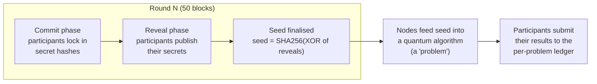

This page bridges the gap between [Overview]() ("what daqq is") and [Architecture]() ("how the code is laid out"). If you are new to blockchains or to commit-reveal randomness, read this first.

## The big picture

daqq is a chain of **blocks**. Each block is roughly one tick of the system clock. Inside every block, every node in the network runs identical logic, so they all agree on what just happened.

Every **50 blocks** the network produces one fresh, unpredictable **256-bit random seed**, agreed on by all nodes. That window of 50 blocks is called a **round**. The seed is what participants feed into a quantum algorithm — every node runs the same algorithm with the same seed, and each node records its own result on-chain so the network can be compared and audited.



The rest of this page defines each term in that diagram.

## Terminology

### Block
A batch of state changes that every node agrees on at the same moment. Blocks have an integer **height** that monotonically increases: block 0 is genesis, block 1 is the next one, and so on. In daqq, blocks are produced roughly every few seconds by validators running Cosmos SDK's CometBFT consensus.

### Node / validator / participant
- **Node**: any computer running `quantumchaind`.
- **Validator**: a node that has bonded `stake` and participates in consensus (proposing and signing blocks).
- **Participant**: anyone — validator or not — who submits commits, reveals, and results to daqq. In daqq there is no economic distinction between validators and ordinary participants because there are no rewards; the validator role exists only because Cosmos SDK requires proof-of-stake to make progress.

### Transaction (tx)
A signed message sent to the chain — e.g. "I commit this hash for round 42", "I reveal this secret", "Here is my result for round 42". Transactions are collected by validators and included in blocks.

### Module
A self-contained piece of chain logic with its own state, messages, and hooks. daqq's chain has four custom modules: `beacon`, `problems`, `random_circuit`, and `quantumchain`. See [Architecture]().

### EndBlocker
A hook each module exposes that runs **at the end of every block**, after all transactions in that block have been processed. The beacon's EndBlocker is what finalises the seed at the end of a round.

### Round / RoundID
A 50-block window. `roundID = blockHeight / 50`. Round 0 is blocks 0–49, round 1 is blocks 50–99, and so on. At the end of each round, the beacon produces one seed for that round.

### Secret
The participant's private random value for the round. By convention it is **32 bytes (256 bits)** of cryptographically random data, submitted as a **64-character hex string**. The size is chosen to match the seed: XORing N values of 32 bytes each gives 32 bytes, which is then SHA-256'd back to 32 bytes. Any other length would either lose entropy or fail the equal-length check during XOR aggregation.

### Commit (commit-reveal: step 1)
The participant locks in their secret without revealing it yet, by sending `MsgCommit{roundID, hash}` on-chain. `hash` is the hex-encoded SHA-256 of the secret's hex string — so the commit payload is also **64 hex characters**. Once stored on-chain the participant cannot change it. This is like sealing a number in an envelope.

### Reveal (commit-reveal: step 2)
Later in the same round, the participant publishes the actual secret via `MsgReveal{roundID, secret}` (64 hex characters). The chain verifies `hex(SHA256(secret)) == committedHash`. This is like opening the envelope. A participant who refuses to reveal contributes nothing to that round's seed — but they also can't bias it, because they were already locked in.

### Seed
The 256-bit random value produced once per round. Calculation:

1. Take every valid reveal in this round and hex-decode each one to its 32 raw bytes.
2. XOR them all together → 32 bytes.
3. SHA-256 the result → 32 bytes, stored hex-encoded (64 chars) as `Seeds[roundID]`.

As long as **at least one participant** picked their secret unpredictably, the XOR result — and therefore the seed — is unpredictable to everyone else in advance.


**Why XOR?** Because XOR has the property *"if even one input is uniformly random, the output is uniformly random, regardless of all other inputs"*. That maps directly to the security model we want: **the seed is unpredictable as long as ≥1 honest participant is present**, no matter how many others collude. XOR is also order-independent and treats every participant equally, so the commit-reveal guarantee (no one can choose their secret after seeing others') carries straight through to the seed. The final SHA-256 is a whitening step: it strips the linear structure of XOR so downstream code can treat the seed as an opaque cryptographic random value.


### Problem
A quantum algorithm (or any deterministic computation seeded by the beacon) that the network has agreed to run, together with the on-chain ledger that stores each participant's result. Examples include random-circuit sampling, randomized benchmarking, variational ansatz evaluation on random Hamiltonians, random Clifford sampling, and so on. Each problem is its own Cosmos SDK module; the `problems` module is the on-chain registry that tracks which problems exist and whether they are currently accepting submissions. See [Problem System]().

## Lifecycle of one round

A round spans 50 blocks. The block offset within the round (`blockHeight % 50`) determines which phase the network is in:

| Offset within round | Phase | What participants can do |
|---|---|---|
| 1 – 30 | **Commit** | Send `MsgCommit{roundID, hash}`. |
| 31 – 45 | **Reveal** | Send `MsgReveal{roundID, secret}`. The chain verifies `hash(secret)` matches the earlier commit. |
| 46 – 49 | (idle) | No commits or reveals accepted for this round. |
| 50 (EndBlocker) | **Finalise** | Beacon XORs all reveals, hashes the result, stores `Seeds[roundID]`, emits a `NewRound` event. |


**Predictable-seed window (offsets 46 – 49).** Reveals close at offset 45, but the seed is not officially stored until the EndBlocker at offset 50. During the 4 blocks in between, every valid reveal is already on-chain and the seed is just `SHA256(XOR(reveals))` — anyone can compute it locally before the chain announces it. Today this has no impact because no shipped problem has a submission deadline, so being "early" buys you nothing. But any future problem that introduces a per-round deadline must account for this 4-block predictability window, or shrink the gap by moving `RevealEnd` closer to `RoundDuration`. See [Known limitations]() for the full list of fairness / security caveats and their severity ratings.


After offset 50, the seed for that round is publicly readable. Any participant can now:

1. Read `Seeds[roundID]`.
2. Pick one (or more) of the registered problems.
3. Run the problem's quantum algorithm locally, seeded by `Seeds[roundID]` — every node that picks the same problem will derive an identical input.
4. Submit its result to the problem's module (e.g. `MsgSubmitResult{roundID, ...}`).

The next round's commit phase has already started in parallel, so the network never sits idle.

```text
block offset within round
            1                            30 31           45 46  49 50
            |─────────────────────────────|──────────────|─────|  |
Beacon:     [======== Commit phase =======][== Reveal ===][idle] ◆ Finalise (EndBlocker)
Problem:                                                          [== Submit results (offset 50+) ==>
```


Commit and Reveal **never overlap**: commits are rejected from offset 31 onward, and reveals are rejected before offset 31. This non-overlap is the security backbone of commit-reveal — see ["Why commit-reveal?"](#why-commit-reveal) below.


## Why commit-reveal?

The naive alternative — "everyone just publishes a random number, XOR them all together" — fails because the **last** participant to publish can see everyone else's numbers and pick their own to bias the result. Commit-reveal forces everyone to lock in *before* anyone reveals, so by the time secrets become public it is too late to bias the outcome.

The remaining attack is **withholding**: a malicious participant who sees that revealing would produce a seed they dislike can simply not reveal. This skews the seed only across the subset of possible "withhold or not" choices, and only as long as you control multiple participants — and it costs you your own contribution to the seed. daqq accepts this residual bias for simplicity; problem-specific modules can layer extra constraints on top if they need stronger guarantees.

## Example: walking through one round of `random_circuit`

To make the abstract pieces concrete, here is what a round looks like when the network is running daqq's first shipped problem, [`random_circuit`]().

**Setup.** All participants have agreed (off-chain) to use circuit width = 4 qubits and depth = 10 for this experiment. Round 42 is about to begin.

**Blocks 1 – 30 of round 42 (Commit phase).** Each participant draws a fresh 32-byte random secret locally, computes its SHA-256, and sends `MsgCommit{roundID: 42, hash: ...}`. Nothing about the secrets is visible on-chain yet.

**Blocks 31 – 45 (Reveal phase).** Each participant publishes their secret with `MsgReveal{roundID: 42, secret: ...}`. The chain checks each reveal against the earlier commit.

**Block 50 (EndBlocker).** The beacon module XORs every accepted reveal, SHA-256s the result, and writes `Seeds[42] = <64-hex-chars>`. A `NewRound` event fires.

**After block 50.** Every participant independently:

1. Reads `Seeds[42]`.
2. Feeds `(seed, width=4, depth=10)` into the random-circuit generator → all participants get the **same** 4-qubit, depth-10 circuit.
3. Computes the theoretical output probability distribution over the 16 basis states locally (by simulation, by hardware execution, by analytic methods — that's the participant's choice).
4. Sends `MsgSubmitResult{roundID: 42, distribution: [...]}` to the `random_circuit` module.

**Outcome.** Anyone can later query the module to read every participant's distribution for round 42. If two participants disagree, the disagreement is on-chain and reproducible — anyone can re-derive the circuit from `Seeds[42]` and check who is right. That is the value daqq adds: not the quantum computation itself, but a **shared, tamper-evident, replayable trail** of who computed what for which random input.

A second problem, say "randomized benchmarking sequences", would slot into the same round in parallel: same seed, different module, different ledger.

## What's next?

- [Architecture]() — how these concepts map to Cosmos SDK modules and their execution order.
- [Problem System]() — how multiple problems coexist on one beacon.
- [beacon module]() — implementation details of the commit-reveal protocol.
- [Known limitations]() — fairness, simultaneity, and security caveats of this design, with severity ratings.
