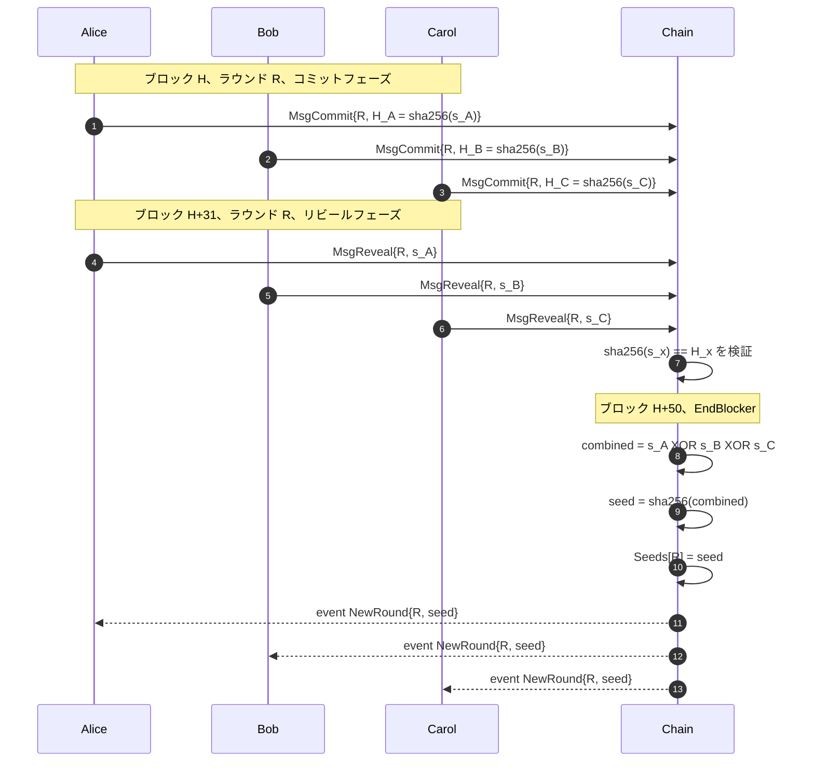

`x/beacon` モジュールは daqq の**ランダムネスビーコン**です。ネットワーク内のすべてのノードが合意するラウンドごとの 256 ビット共有シードを 1 つ生成します。

## ラウンド構造

ラウンドは **50 ブロック**（`RoundDuration = 50`）続き、3 つのフェーズに分かれます。

| フェーズ | ラウンド内のブロック範囲 | 参加者が行うこと |
|---|---|---|
| **コミット** | `0`–`30` | `MsgCommit{roundID, hash}` を提出（`hash = sha256(secret)`） |
| **リビール** | `31`–`45` | `MsgReveal{roundID, secret}` を提出。チェーンが `sha256(secret) == commits[creator]` を検証 |
| **確定** | `50`（EndBlocker） | チェーンがすべてのリビールを XOR し、結果をハッシュし、`Seeds[roundID]` を格納 |

```text
ラウンド内のブロックオフセット
            0                            30 31           45 46  49 50
            |─────────────────────────────|──────────────|─────|  |
フェーズ:    [======== コミットフェーズ =====][== リビール ===][アイドル] ◆ 確定 (EndBlocker)
```

コミットとリビールのウィンドウは**決して重なりません** — `MsgCommit` はオフセット 31 以降は拒否され、`MsgReveal` はオフセット 31 より前は拒否されます。この非重複が、シードに対する「他人を見てからコミット」攻撃を防ぎます。

## プロトコル

### 1. コミット

各参加者は秘密 `s_i ∈ {0,1}^256` を生成し、`H_i = sha256(s_i)` を提出します。

\[
H_i = \mathrm{SHA256}(s_i)
\]

`quantum-chain/x/beacon/keeper/msg_server_commit.go:13-50` で実装されています。コミットウィンドウ外のコミットは拒否されます。

### 2. リビール

同じ参加者が後で `s_i` を送ります。チェーンは以下を確認します：

\[
\mathrm{SHA256}(s_i) \stackrel{?}{=} H_i
\]

格納されたコミットとハッシュが一致しないリビールは拒否されるため、参加者はコミットした秘密に拘束されます。

`quantum-chain/x/beacon/keeper/msg_server_reveal.go:16-64` で実装されています。

### 3. 集約（`height % 50 == 0` の EndBlocker）

\(S = \{s_1, \dots, s_n\}\) をそのラウンドのリビールされた秘密の集合とすると、最終シードは：

\[
\mathrm{seed} = \mathrm{SHA256}\left( \bigoplus_{i=1}^{n} s_i \right)
\]

XOR は可換なので、リビールの読み取り順序は結果に影響しません。すべてのノードがビット単位で同じ値を計算します。

`quantum-chain/x/beacon/keeper/abci.go:48-65` で実装されています。



## 状態

`quantum-chain/x/beacon/keeper/keeper.go:26-29` より：

| コレクション | キー | 値 | 意味 |
|---|---|---|---|
| `RoundInfo` | – | `uint64` | 現在のラウンドカウンタ |
| `Commits` | `(roundID, creator)` | `hash` | ラウンドごとの参加者ごとのコミットハッシュ |
| `Reveals` | `(roundID, creator)` | `secret` | ラウンドごとの参加者ごとのリビールされた秘密 |
| `Seeds` | `roundID` | `finalSeed` | 完了したラウンドの最終シード |

## イベント

`quantum-chain/x/beacon/types/events.go:4-8` より：

```
EventType: new_round
Attributes:
  round_id: <uint64>
  seed:     <hex string>
```

共有シード通知を受け取るには `tm.event='Tx' AND new_round.round_id EXISTS` を購読してください。

## セキュリティモデル

| 仮定 | 結果 |
|---|---|
| 高エントロピーな秘密による正直なリビールが少なくとも 1 つ | リビールフェーズ終了前にシードは敵対者に予測不可能 |
| 敵対者がすべてのリビールを制御 | 敵対者はリビールを最後まで withhold することでシードを選べる |
| 敵対者がリビールを withhold | その参加者の秘密は除外される；正直な XOR は依然として予測不可能な値を生成 |


RANDAO は、リビールするかしないかを選べる最終リビーラーによって偏らせられます。VDF（検証可能遅延関数）のような緩和策は、この MVP の範囲外です。


## 統合

プロブレムモジュールは `BeaconKeeper` インタフェースを介してシードを消費します — 例として `x/random_circuit`：

```go
// quantum-chain/x/random_circuit/types/expected_keepers.go
type BeaconKeeper interface {
    GetSeed(ctx context.Context, roundID uint64) (string, error)
}
```

`MsgSubmitResult`（`random_circuit` 内）は `GetSeed(roundID)` を呼び、ビーコンがラウンドを確定するまで結果の受理を拒否します。将来のプロブレムモジュールも同じパターンに従います。
