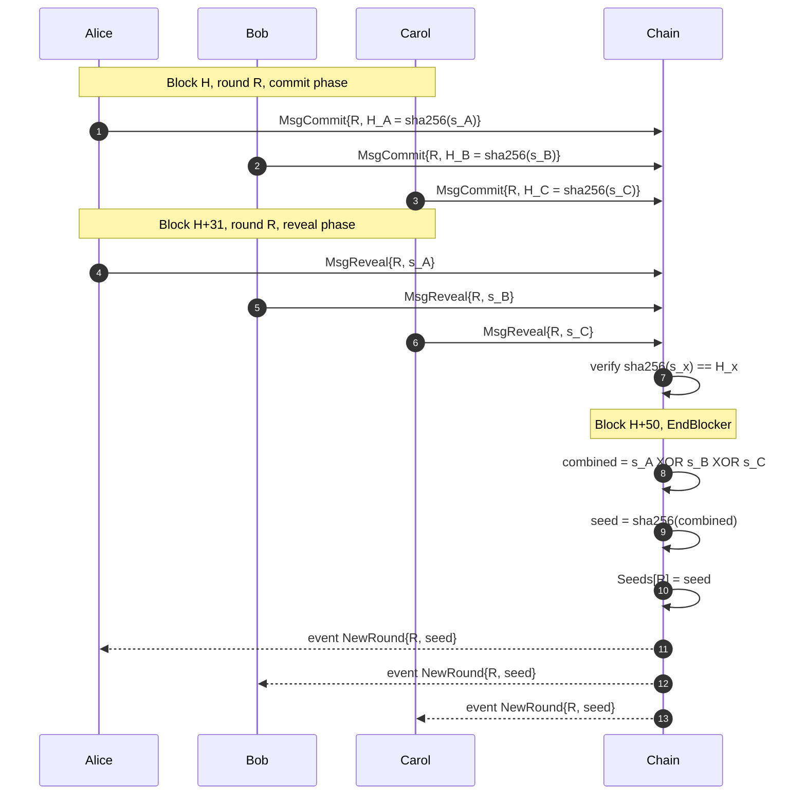

The `x/beacon` module is daqq's **randomness beacon**. It produces a single shared 256-bit seed per round that every node in the network agrees on.

## Round structure

A round lasts **50 blocks** (`RoundDuration = 50`) and is divided into three phases:

| Phase | Block range within round | What participants do |
|---|---|---|
| **Commit** | `0`–`30` | Submit `MsgCommit{roundID, hash}` where `hash = sha256(secret)` |
| **Reveal** | `31`–`45` | Submit `MsgReveal{roundID, secret}`; chain verifies `sha256(secret) == commits[creator]` |
| **Finalise** | `50` (EndBlocker) | Chain XORs all reveals, hashes the result, stores `Seeds[roundID]` |

```text
block offset within round
            0                            30 31           45 46  49 50
            |─────────────────────────────|──────────────|─────|  |
Phase:      [======== Commit phase =======][== Reveal ===][idle] ◆ Finalise (EndBlocker)
```

Commit and Reveal windows **never overlap** — `MsgCommit` is rejected from offset 31 onward, and `MsgReveal` is rejected before offset 31. This non-overlap is what prevents a "see-others-then-commit" attack on the seed.

## Protocol

### 1. Commit

Each participant generates a secret `s_i ∈ {0,1}^256` and submits `H_i = sha256(s_i)`.

\[
H_i = \mathrm{SHA256}(s_i)
\]

Implemented in `quantum-chain/x/beacon/keeper/msg_server_commit.go:13-50`. Commits outside the commit window are rejected.

### 2. Reveal

The same participant later sends `s_i`. The chain checks:

\[
\mathrm{SHA256}(s_i) \stackrel{?}{=} H_i
\]

A reveal whose hash does not match the stored commit is rejected, so participants are bound to the secret they committed.

Implemented in `quantum-chain/x/beacon/keeper/msg_server_reveal.go:16-64`.

### 3. Aggregate (EndBlocker at `height % 50 == 0`)

Let \(S = \{s_1, \dots, s_n\}\) be the set of revealed secrets for the round. The final seed is

\[
\mathrm{seed} = \mathrm{SHA256}\left( \bigoplus_{i=1}^{n} s_i \right)
\]

XOR is commutative, so the order in which reveals are read does not affect the result. Every node computes the same value bit-for-bit.

Implemented in `quantum-chain/x/beacon/keeper/abci.go:48-65`.



## State

From `quantum-chain/x/beacon/keeper/keeper.go:26-29`:

| Collection | Key | Value | Meaning |
|---|---|---|---|
| `RoundInfo` | – | `uint64` | Current round counter |
| `Commits` | `(roundID, creator)` | `hash` | Commit hash per participant per round |
| `Reveals` | `(roundID, creator)` | `secret` | Revealed secret per participant per round |
| `Seeds` | `roundID` | `finalSeed` | Final seed for a completed round |

## Events

From `quantum-chain/x/beacon/types/events.go:4-8`:

```
EventType: new_round
Attributes:
  round_id: <uint64>
  seed:     <hex string>
```

Subscribe to `tm.event='Tx' AND new_round.round_id EXISTS` to receive shared-seed notifications.

## Security model

| Assumption | Consequence |
|---|---|
| At least one honest reveal with high-entropy secret | Seed is unpredictable to adversaries before reveal phase ends |
| Adversary controls all reveals | Adversary can choose seed by withholding their reveal until last |
| Adversary withholds a reveal | That participant's secret is excluded; honest XOR still produces an unpredictable value |


RANDAO is biasable by the last revealer if they can choose to reveal or not. Mitigations like VDFs (verifiable delay functions) are out of scope for this MVP.


## Integration

Problem modules consume the seed via the `BeaconKeeper` interface — for example `x/random_circuit`:

```go
// quantum-chain/x/random_circuit/types/expected_keepers.go
type BeaconKeeper interface {
    GetSeed(ctx context.Context, roundID uint64) (string, error)
}
```

`MsgSubmitResult` (in `random_circuit`) calls `GetSeed(roundID)` and refuses to accept results until the beacon has finalised the round. Any future problem module follows the same pattern.
