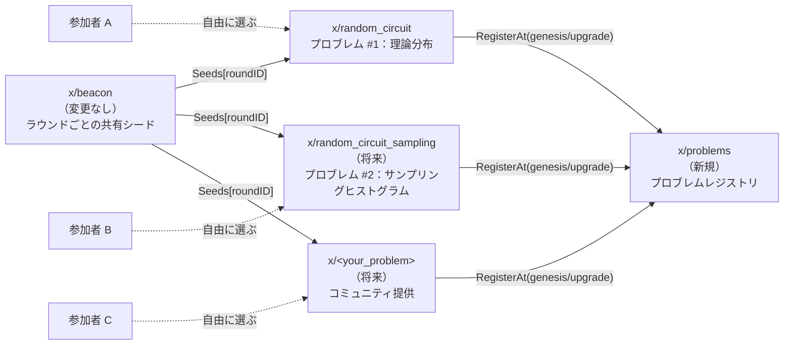
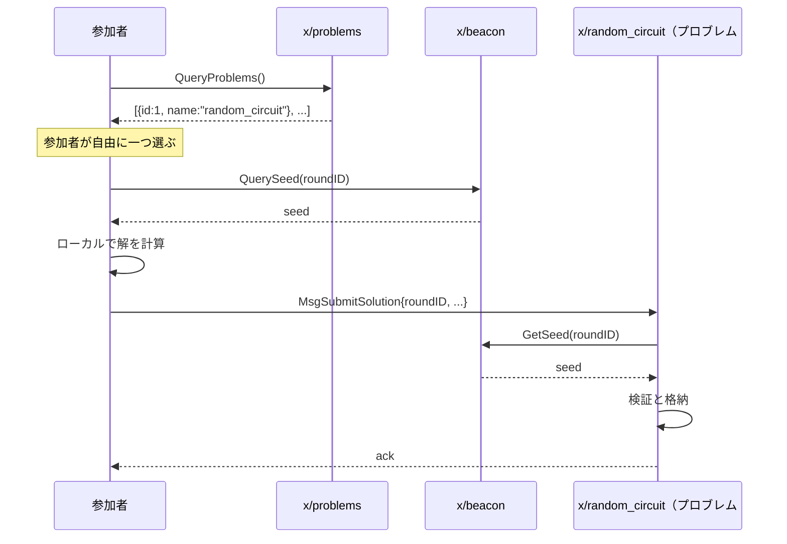
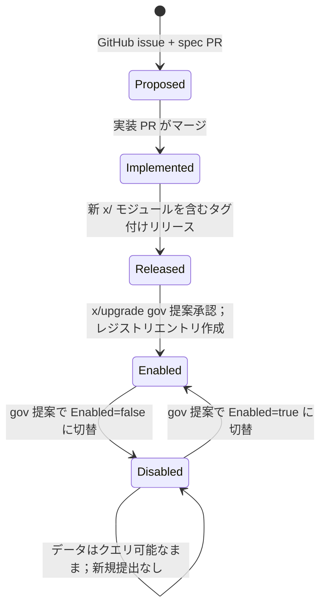

このドキュメントは daqq の**プロブレムシステム**を定義します — 固定された「共有ランダム量子回路」チェーンから、**複数のプロブレムが共存し、それぞれが同じ共有ランダムネスビーコンによって消費され、参加者が自由に選択できる汎用プラットフォーム**へと daqq を変えるフレームワークです。


**ステータス**：MVP 実装済み。`x/qcledger` は `x/random_circuit` に改名され、チェーンジェネシス時に新しい `x/problems` モジュールに**プロブレム #1** として自己登録されます。モジュールレベルのドキュメントは [random_circuit](modules/random_circuit) と [problems](modules/problems) を参照してください。


## 目標

1. **複数のプロブレムがオンチェーンで共存できる**。現在の単一目的の台帳が、多数のプロブレムの一つになります。
2. **参加者がどのプロブレムを解くかを選ぶ**。誰もラウンド全体の単一プロブレムに強制されない。
3. **共有ビーコンシードが共通の入力として残る**。すべてのプロブレムが同じラウンドごとのシードを読める。
4. **新しいプロブレムは Cosmos アップグレードガバナンスによって追加される**。MVP ではオンチェーンの WASM や動的コードロードは行わない。
5. **プロブレムは決して削除されない**。停止されたプロブレムは `enabled = false` でフラグ立てられる。その履歴データは永遠に有効です。

## 非目標（MVP の範囲外）

- オンチェーンのユーザー提供コード（CosmWasm 等）。スキーマは概念的にのみその余地を残す。
- ラウンドごとの単一の「勝者」、スコアリング、または報酬。
- プロブレム横断的な集約。

## アーキテクチャ



### モジュールの責務

| モジュール | 役割 |
|---|---|
| `x/beacon` | 変更なし。ラウンドごとに 256 ビットの `Seeds[roundID]` を生成する。 |
| `x/problems` | 新規。プロブレムの**レジストリ**を保持する：ID、名前、所有モジュール、enabled フラグ、追加されたラウンド。 |
| `x/random_circuit` | 旧 `x/qcledger`。**プロブレム #1** を実装：ランダムに生成された量子回路の理論的出力分布。 |
| `x/<future_problems>` | 将来のモジュール。各々がジェネシスまたはアップグレード時に `x/problems` に自己登録する。 |

### 参加者のフロー



各プロブレムモジュールは独自のメッセージ型、検証、ストレージを所有します。`x/problems` モジュールは純粋にディレクトリです。

## データモデル

### `x/problems`

```go
type ProblemKind int32

const (
    PROBLEM_KIND_BUILTIN ProblemKind = 0
    // PROBLEM_KIND_WASM ProblemKind = 1 // MVP では意図的に未予約；
    //                                     // 下の「将来の拡張」を参照。
)

type Problem struct {
    ID           uint64
    Name         string      // ユニーク、例 "random_circuit"
    ModuleName   string      // 実装モジュール、例 "random_circuit"
    Kind         ProblemKind // 今のところ BUILTIN のみ
    Enabled      bool        // false なら新規提出を受け付けない；履歴は保持
    AddedAtRound uint64      // このプロブレムが選択可能になった最初のラウンド
    Description  string      // 短い人間可読の要約
}

type Params struct {
    NextProblemID uint64 // 単調増加；ID は決して再利用されない
}
```

**不変条件：**

- ID は順次割り当てられ、無効化後も**決して再利用されない**。
- プロブレムは**追加または切り替えのみ**で、決して削除されない。
- `Name` は無効化されたものを含めすべてのプロブレムでユニーク。

### `x/random_circuit`（旧 `x/qcledger`）

プロブレム #1 への提出された解を格納します。各提出は、ラウンドのシードから生成されたランダム回路について、参加者がローカルに計算した**理論的出力確率分布**を表します。

```go
type Submission struct {
    RoundID    uint64
    ProblemID  uint64    // 常に random_circuit プロブレムの ID
    Submitter  string    // bech32 アドレス
    // MVP (A) では：厳密な理論分布
    Distribution []DistributionEntry
    // TODO(将来 B): 別プロブレム 'random_circuit_sampling' が追加されるとき、
    //              ヒストグラムカウント、サンプル数、（任意で）デバイスメタデータを
    //              運ぶ独自の Submission 型を使う。
    SubmittedAtBlock int64
}

type DistributionEntry struct {
    BasisState uint64  // 計算基底のインデックス（0..2^n-1）
    Probability string // ノード間の浮動小数点の丸めの問題を避けるための十進文字列
}
```

## ラウンドと提出のルール

- ラウンド `R` の提出は、`beacon.Seeds[R]` が確定された後にのみ受理されます（つまり、ブロック `R*50` の EndBlocker の後）。
- ラウンド `R` の提出はその後も無期限に受理されます（MVP では締切なし）。締切ルールは後でパラメータで追加できます。
- 提出者は `(ラウンド, プロブレム)` のペアごとに最大 1 つの解を提出できます。再提出は拒否されます。
- `Enabled=false` 状態は、メッセージハンドラレベルで新規提出が拒否されることを意味します。既存の提出はクエリ可能なまま残ります。

## プロブレムの選択

オンチェーンの選択メカニズムは**ありません**。参加者は：

1. `x/problems` をクエリしてすべての `Enabled=true` のプロブレムをリストする。
2. どのプロブレムを解くかをローカルに決める。
3. 1 つ以上のプロブレムモジュールに提出する。

これが「β」モデルの定義的特性です：各参加者が独立して何を解くかを選びます。チェーンは共通のシードと共通のレジストリを提供し、それ以外はすべて任意です。

## プロブレムのライフサイクル



`Disabled` には `[*]` への出口がないという意味で**終端的**ですが、プロブレムは決してレジストリから去りません。

## 新しいプロブレムの追加（コミュニティ貢献）

完全なプロセスは [貢献 → プロブレムの提案](#)（TODO）に記載されます。要点：

1. プロブレムを記述する GitHub issue を開く：入力、出力、検証、期待される用途。
2. `docs/content/docs/modules/` に下書きの markdown を追加する spec PR を提出する。
3. Go で新しい `x/<problem>` モジュールを実装する。
4. そのモジュールは：
   - `BeaconKeeper.GetSeed(ctx, roundID)` に依存する。
   - ジェネシス init またはアップグレードハンドラで `ProblemsKeeper.Register(...)` をべき等に呼ぶ。
   - 独自のメッセージとストレージを定義する。
5. 新しいモジュールを含むリリースを切る。
6. リリースを指す `software-upgrade` ガバナンス提案を提出する。
7. アップグレード高さで、すべてのノードが新バイナリで再起動し、レジストリエントリが現れる。

## プロブレムの無効化

プロブレムが新規提出を受け付けるのを止めるには：

1. `problems.Problem[id].Enabled` を `false` に切り替えるパラメータ変更ガバナンス提案を提出する。
2. 提案が可決されたら、実装モジュールのメッセージハンドラが新規提出を拒否し始める。
3. 履歴の提出とクエリは引き続き動作する。

無効化にコード変更やバイナリアップグレードは不要です — gov 提案だけです。

## 将来の拡張

- **プロブレム B：`random_circuit_sampling`**。同じ回路生成ロジックだが、サンプル数と任意のデバイスメタデータを伴うサンプリングヒストグラムを受け付ける。検証は統計的（例：プロブレム A の理論分布に対する χ²）。新しい `x/random_circuit_sampling` モジュールとして追加される予定。
- **WASM プロブレム（`Kind=WASM`）**。MVP では意図的に未実装。本当にパーミッションレスなプロブレム追加（Tx、gov ではなく）が望ましいなら、`x/wasm` を導入し、新しい `ProblemKind` を追加し、プロブレムが WASM コード ID を指せるようにできる。
- **提出締切／ラウンドウィンドウ**。プロブレムごとの `submission_window` パラメータで時間制限付きの競争を可能にする。
- **プロブレム横断の集約／スコアボード**。範囲外。

## 実装計画

1. `x/qcledger` を `x/random_circuit` に**改名**する（Go パッケージ、proto パッケージ、モジュール名、Cosmos キー、expected-keepers、アプリ配線）。このステップでは意味的な変更なし。
2. プロブレム #1 の**解の型を定義**する：現在の `MsgSubmitResult` が運ぶものを上記の `Distribution` ペイロードに置き換える。将来の `random_circuit_sampling` モジュールを参照する TODO コメントを追加する。
3. レジストリ、パラメータ、クエリ、無効化 gov 提案を伴う **`x/problems` を追加**する。ジェネシスがレジストリにプロブレム #1（`random_circuit`）をシードする。
4. ジェネシスで `x/random_circuit` が `x/problems` に**自己登録するよう配線**する。
5. **ドキュメントを更新**：`x/problems` と `x/random_circuit` のモジュールリファレンスページを追加する；`qcledger` ページをリダイレクトに置き換えて非推奨にする；実装後にこのページを具体的な proto 定義で拡張する。
6. **マイグレーションのメモ**：本番チェーンはまだ動いていないため、オンチェーン状態のマイグレーションは不要です。すでにローカルでチェーンが開始されている場合は、`localnet:clean` / `quickstart:clean` で再初期化してください。

## 後で検討する未解決の問題

- `Distribution` ペイロードの厳密な検証は何か？（合計が約 1、次元 = `2^width` など） — `x/random_circuit` モジュールドキュメントで指定する。
- 各ラウンドで回路の `width`/`depth` はどう選ばれるか？ジェネシスパラメータで一定？シードから導出？ — 後で決定する。
- 大きな回路での状態肥大を防ぐため、`x/random_circuit` は `Distribution` のバイトサイズを上限付けるべきか？
