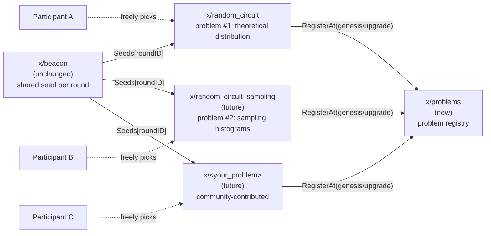
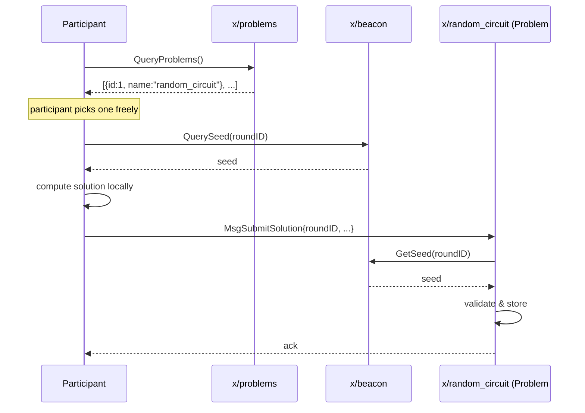

This document defines daqq's **Problem System**: the framework that turns daqq from a fixed "shared random quantum circuit" chain into a **general platform where multiple problems can coexist**, each consumed by the same shared randomness beacon, and each chosen freely by participants.


**Status**: MVP implemented. `x/qcledger` has been renamed to `x/random_circuit` and registers itself as **Problem #1** in the new `x/problems` module at chain genesis. See [random_circuit](modules/random_circuit) and [problems](modules/problems) for the module-level documentation.


## Goals

1. **Multiple problems can coexist on-chain.** The current single-purpose ledger becomes one of many.
2. **Participants choose which problem to solve.** No one is forced into a single round-wide problem.
3. **The shared beacon seed remains the common input.** Every problem can read the same per-round seed.
4. **New problems are added through Cosmos upgrade governance.** No on-chain WASM or dynamic code loading in the MVP.
5. **No problem is ever deleted.** Stopped problems are flagged `enabled = false`; their historical data stays valid forever.

## Non-goals (for the MVP)

- On-chain user-supplied code (e.g., CosmWasm). The schema leaves room for this only conceptually.
- A single "winner" per round, scoring, or rewards.
- Cross-problem aggregation.

## Architecture



### Module responsibilities

| Module | Role |
|---|---|
| `x/beacon` | Unchanged. Produces a 256-bit `Seeds[roundID]` per round. |
| `x/problems` | New. Holds the **registry** of problems: ID, name, owning module, enabled flag, added round. |
| `x/random_circuit` | The renamed `x/qcledger`. Implements **Problem #1**: theoretical output distribution of a randomly generated quantum circuit. |
| `x/<future_problems>` | Future modules. Each registers itself into `x/problems` at genesis or upgrade time. |

### Participant flow



Each problem module owns its own message types, validation, and storage. The `x/problems` module is purely a directory.

## Data model

### `x/problems`

```go
type ProblemKind int32

const (
    PROBLEM_KIND_BUILTIN ProblemKind = 0
    // PROBLEM_KIND_WASM ProblemKind = 1 // intentionally unreserved in the MVP;
    //                                     // see "Future extensions" below.
)

type Problem struct {
    ID           uint64
    Name         string      // unique, e.g. "random_circuit"
    ModuleName   string      // implementing module, e.g. "random_circuit"
    Kind         ProblemKind // BUILTIN only for now
    Enabled      bool        // false => no new submissions accepted; history kept
    AddedAtRound uint64      // first round at which this problem was selectable
    Description  string      // short human-readable summary
}

type Params struct {
    NextProblemID uint64 // monotonically increasing; IDs are never reused
}
```

**Invariants:**

- IDs are assigned sequentially and **never reused** even after disable.
- Problems are **only added or toggled**, never deleted.
- `Name` is unique across all problems, **including disabled ones**.

### `x/random_circuit` (renamed `x/qcledger`)

Stores submitted solutions to Problem #1. Each submission represents a participant's locally computed **theoretical output probability distribution** for the random circuit generated from the round's seed.

```go
type Submission struct {
    RoundID    uint64
    ProblemID  uint64    // always == ID of random_circuit problem
    Submitter  string    // bech32 address
    // For MVP (A): exact theoretical distribution
    Distribution []DistributionEntry
    // TODO(future B): when a separate problem 'random_circuit_sampling' is added,
    //                 it will use its own Submission type carrying histogram counts,
    //                 sample size, and (optional) device metadata.
    SubmittedAtBlock int64
}

type DistributionEntry struct {
    BasisState uint64  // computational basis index (0..2^n-1)
    Probability string // decimal string to avoid float rounding issues across nodes
}
```

## Round and submission rules

- Submissions for round `R` are accepted only after `beacon.Seeds[R]` is finalised (i.e., after the EndBlocker at block `R*50`).
- Submissions for round `R` are accepted indefinitely thereafter (no closing deadline in the MVP). Closing rules can be added later via params.
- A submitter may submit at most one solution per `(round, problem)` pair. Re-submissions are rejected.
- The `Enabled=false` state means new submissions are rejected at the message handler level; existing submissions remain queryable.

## Choosing a problem

There is **no on-chain selection mechanism**. Participants:

1. Query `x/problems` to list all `Enabled=true` problems.
2. Decide locally which problem(s) to solve.
3. Submit to one or more problem modules.

This is the defining property of the "β" model: each participant independently picks what to solve. The chain provides the common seed and the common registry; everything else is voluntary.

## Lifecycle of a problem

```mermaid
stateDiagram-v2
    [*] --> Proposed: GitHub issue + spec PR
    Proposed --> Implemented: implementation PR merged
    Implemented --> Released: tagged release with the new x/<problem> module
    Released --> Enabled: x/upgrade gov proposal accepted; registry entry created
    Enabled --> Disabled: gov proposal flips Enabled=false
    Disabled --> Enabled: gov proposal flips Enabled=true
    Disabled --> Disabled: data remains queryable; no new submissions
```



Note that **`Disabled` is terminal in the sense that there is no `[*]` exit**: a problem never leaves the registry.

## Adding a new problem (community contribution)

The full process is documented under [Contributing → Proposing a Problem](#) (TODO). In short:

1. Open a GitHub issue describing the problem: inputs, outputs, verification, expected use.
2. Submit a spec PR adding a draft markdown to `docs/content/docs/modules/`.
3. Implement the new `x/<problem>` module in Go.
4. The module must:
   - Depend on `BeaconKeeper.GetSeed(ctx, roundID)`.
   - Call `ProblemsKeeper.Register(...)` at genesis init or in its upgrade handler, idempotently.
   - Define its own messages and storage.
5. Cut a release containing the new module.
6. Submit a `software-upgrade` governance proposal pointing at the release.
7. On the upgrade height, every node restarts on the new binary and the registry entry appears.

## Disabling a problem

To stop a problem from accepting new submissions:

1. Submit a parameter-change governance proposal flipping `problems.Problem[id].Enabled` to `false`.
2. After the proposal passes, the message handler in the implementing module starts rejecting new submissions.
3. Historical submissions and queries continue to work.

No code change or binary upgrade is required for disabling — only a gov proposal.

## Future extensions

- **Problem B: `random_circuit_sampling`.** Same circuit-generation logic, but accepts sampling histograms with sample count and optional device metadata. Verification will be statistical (e.g., χ² against the theoretical distribution from Problem A). To be added as a new `x/random_circuit_sampling` module.
- **WASM problems (`Kind=WASM`).** Intentionally not implemented in the MVP. If we ever want truly permissionless problem addition (Tx, not gov), we can introduce `x/wasm`, add a new `ProblemKind`, and let problems point to a WASM code ID.
- **Submission deadlines / round windows.** A per-problem `submission_window` parameter to allow time-bounded competitions.
- **Cross-problem aggregation / scoreboards.** Out of scope.

## Implementation plan

1. **Rename** `x/qcledger` → `x/random_circuit` (Go package, proto package, module name, Cosmos keys, expected-keepers, app wiring). No semantic change in this step.
2. **Define the solution type** for Problem #1: replace whatever the current `MsgSubmitResult` carries with the `Distribution` payload above. Add a TODO comment referencing the future `random_circuit_sampling` module.
3. **Add `x/problems`** with the registry, params, queries, and the disable gov proposal. The genesis seeds the registry with Problem #1 (`random_circuit`).
4. **Wire `x/random_circuit` to register itself** into `x/problems` at genesis.
5. **Update docs**: add module reference pages for `x/problems` and `x/random_circuit`; deprecate the `qcledger` page in favour of a redirect; expand this page with concrete proto definitions once implemented.
6. **Migration note**: because no production chain is running yet, no on-chain state migration is needed. If a chain has already been started locally, `localnet:clean` / `quickstart:clean` and re-init.

## Open questions for later

- What is the precise validation for the `Distribution` payload? (Must sum to ~1, dimension = `2^width`, etc.) — to be specified in `x/random_circuit` module doc.
- How is `width`/`depth` of the circuit chosen per round? Constant in genesis params? Derived from seed? — to be decided.
- Should `x/random_circuit` cap the byte size of `Distribution` to prevent state bloat for large circuits?
